# SurveyHub

An AI-powered survey platform built with Next.js 15 and Django REST Framework. Generate surveys from a prompt, collect responses, and analyse results — all in one place.

**Live demo:** https://surveyhub-aha.pages.dev  
**API:** https://surveyhub-api.fly.dev

---

## Screenshots

### Landing Page
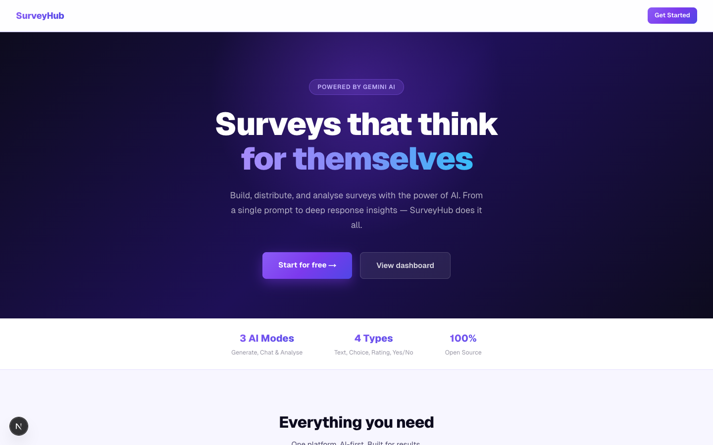

### Authentication
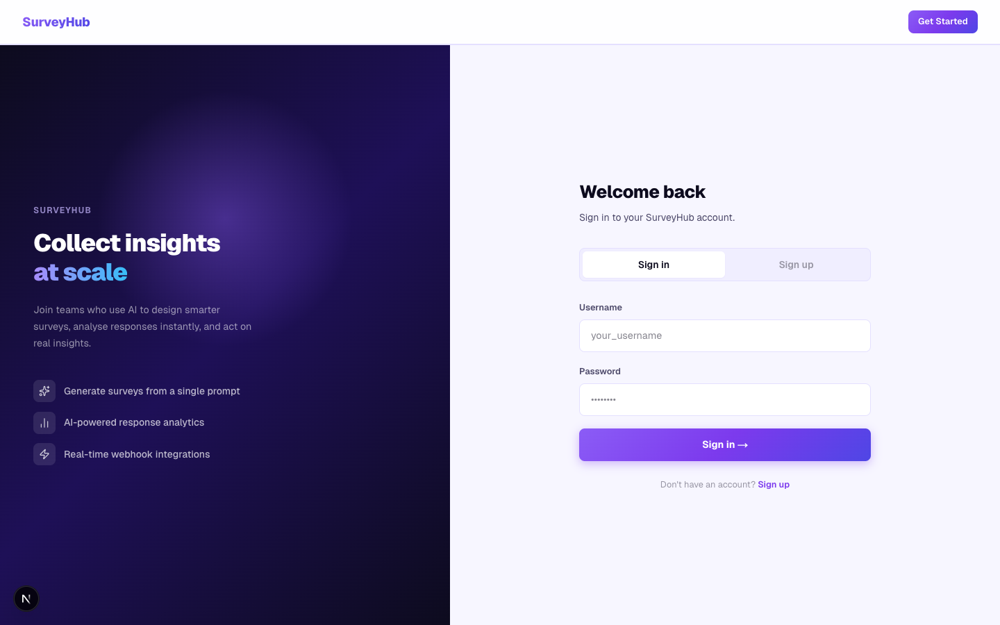

### Dashboard
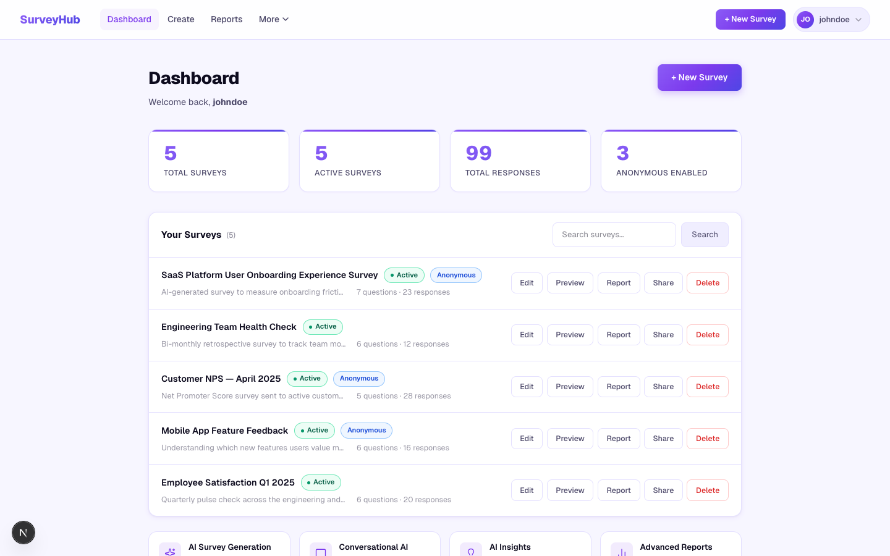

### Survey Builder
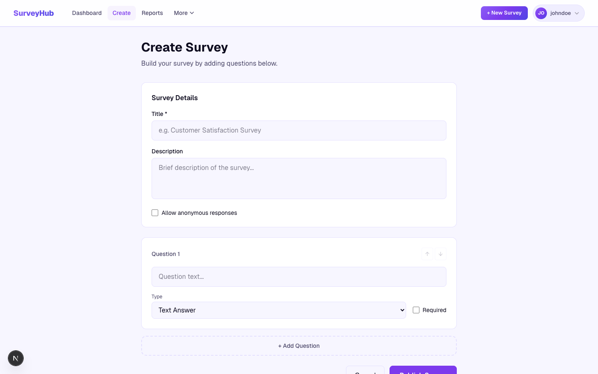

### Response Reports & Analytics
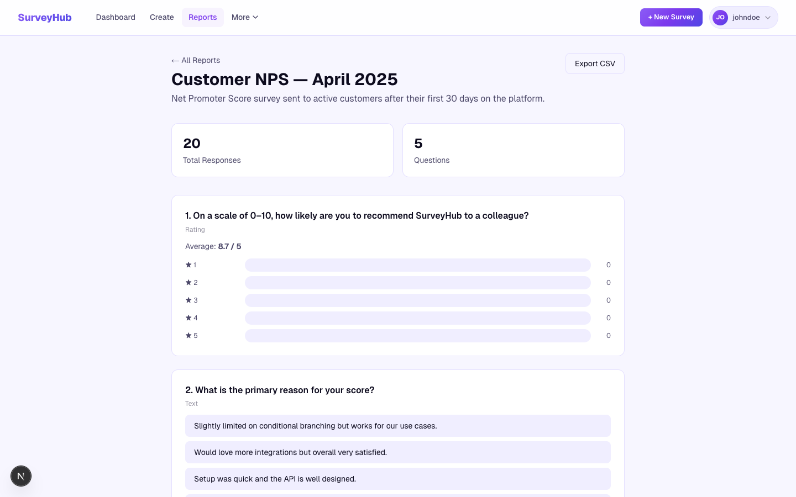

### AI Survey Generation
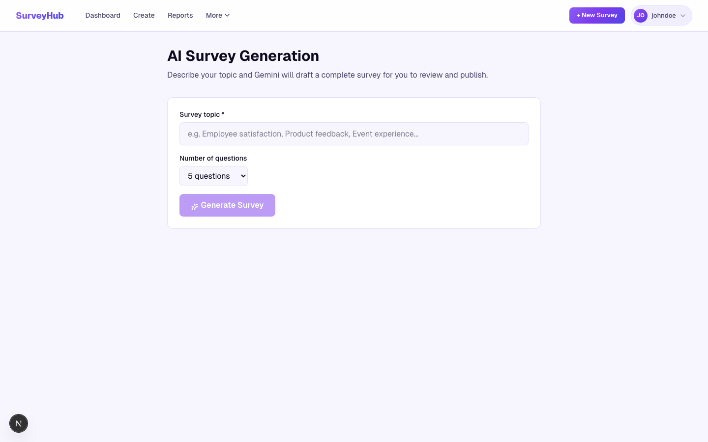

### Conversational AI Builder
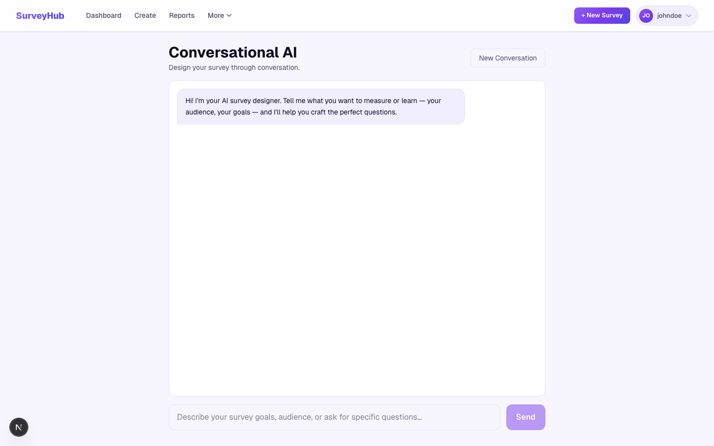

### AI Response Insights
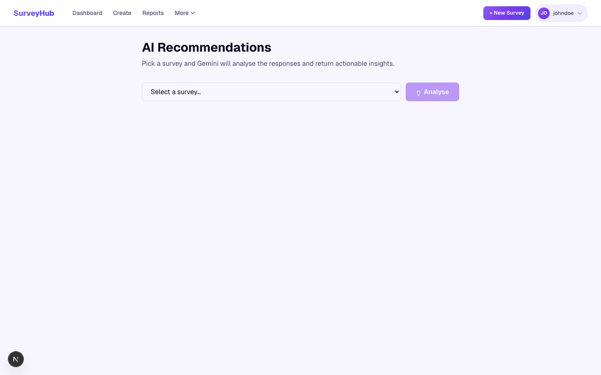

### Webhook Integrations
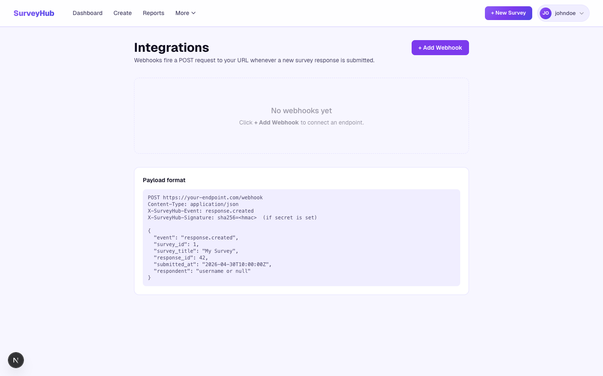

### Advanced Reporting
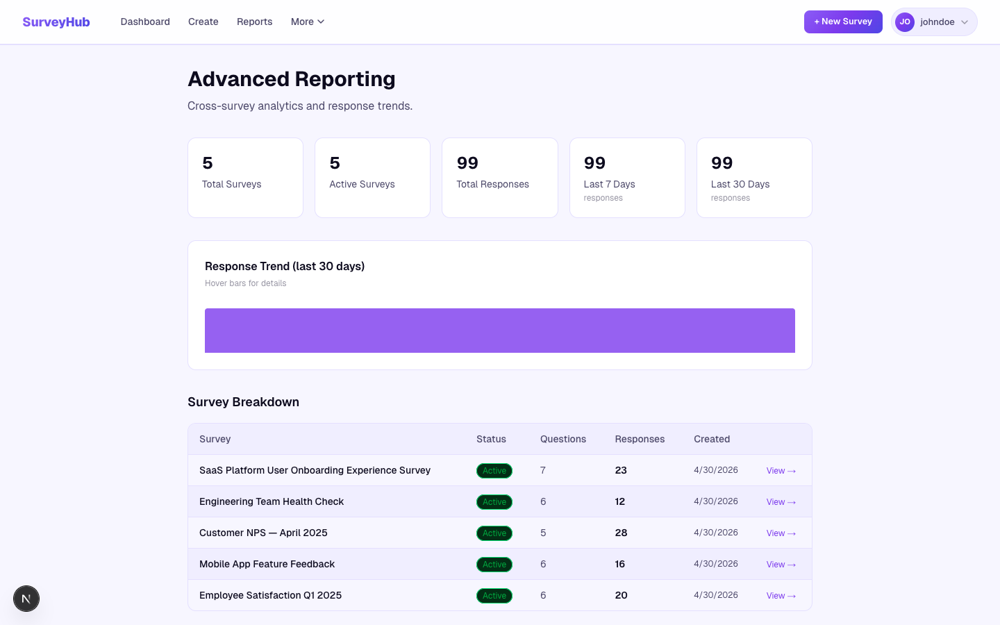

### Notifications
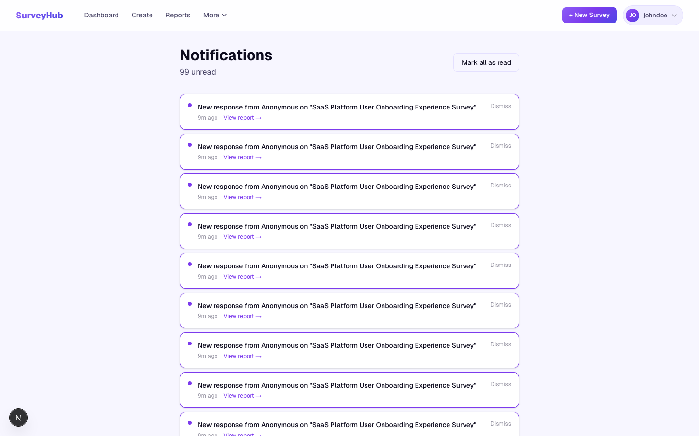

### App Tour (on first login)
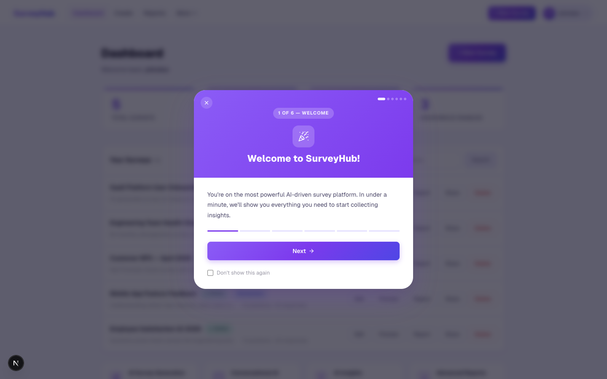

---

## Features

| Feature | Description |
|---|---|
| **AI Survey Generation** | Describe a topic — Gemini drafts a complete survey with mixed question types in seconds |
| **Conversational Builder** | Chat naturally with an AI to design the perfect survey through dialogue |
| **AI Response Insights** | Get executive summaries, sentiment analysis, and recommendations on your response data |
| **Rich Analytics** | Visual response breakdowns per question, completion stats, and one-click CSV export |
| **Webhook Integrations** | Fire real-time POST events to any endpoint on new responses; sign payloads with HMAC-SHA256 |
| **Role Management** | Invite team members and control access to surveys and data |
| **Survey Builder** | Build text, multiple-choice, rating, and yes/no questions with an intuitive drag-free UI |
| **Distribution** | Shareable links, embed code, and QR codes for every survey |
| **Notifications** | In-app notification feed for survey activity |
| **App Tour** | First-login guided tour with "Don't show again" option |

**Question types:** Text · Multiple Choice · Rating (1–5 stars) · Yes/No

---

## Tech Stack

| Layer | Technology |
|---|---|
| Frontend | Next.js 15 (App Router), React 19, TypeScript |
| Styling | CSS custom properties, Lucide React icons |
| Backend | Django 5.1, Django REST Framework, SimpleJWT |
| AI | Google Gemini (`google-genai`) |
| Database | Neon serverless PostgreSQL |
| Auth | JWT (access + refresh tokens stored in localStorage) |
| Webhooks | HMAC-SHA256 signed POST delivery via background threads |
| Hosting | Cloudflare Pages (frontend) + Fly.io (backend) |

---

## Getting Started

### Prerequisites

- Node.js 18+ / Bun
- Python 3.9+
- PostgreSQL

### 1. Database

```sql
CREATE DATABASE surveyhub;
CREATE USER surveyhubuser WITH PASSWORD 'yourpassword';
GRANT ALL PRIVILEGES ON DATABASE surveyhub TO surveyhubuser;
ALTER USER surveyhubuser CREATEDB;
```

### 2. Backend

```bash
cd surveyhubbackend
python3 -m venv venv && source venv/bin/activate
pip install -r requirements.txt

# Copy env and fill in values
cp .env.example .env

python manage.py migrate
python manage.py createsuperuser
python manage.py runserver 8000
```

### 3. Frontend

```bash
cd surveyhub-frontend
bun install           # or: npm install

# Create .env.local
echo "NEXT_PUBLIC_API_URL=http://localhost:8000" > .env.local
echo "NEXT_PUBLIC_GEMINI_API_KEY=your_key_here" >> .env.local

bun dev               # or: npm run dev
```

Open [http://localhost:3000](http://localhost:3000).

### 4. Docker Compose (all-in-one)

```bash
# From project root
docker-compose up --build
```

Services:
- `db` — PostgreSQL 16
- `backend` — Django + Gunicorn on port 8000
- `frontend` — Next.js on port 3000

---

## Environment Variables

### Backend (`surveyhubbackend/.env`)

| Variable | Description |
|---|---|
| `SECRET_KEY` | Django secret key |
| `DB_NAME` | PostgreSQL database name |
| `DB_USER` | PostgreSQL user |
| `DB_PASSWORD` | PostgreSQL password |
| `DB_HOST` | PostgreSQL host (default: `localhost`) |
| `DB_PORT` | PostgreSQL port (default: `5432`) |
| `GEMINI_API_KEY` | Google Gemini API key |

### Frontend (`surveyhub-frontend/.env.local`)

| Variable | Description |
|---|---|
| `NEXT_PUBLIC_API_URL` | Backend base URL (default: `http://localhost:8000`) |
| `NEXT_PUBLIC_GEMINI_API_KEY` | Google Gemini API key |

---

## API Reference

All endpoints are prefixed with `/api/`.

| Method | Path | Auth | Description |
|---|---|---|---|
| POST | `auth/register/` | None | Register and receive JWT pair |
| POST | `auth/login/` | None | Login and receive JWT pair |
| GET/PATCH | `auth/user/` | Required | Get or update profile |
| POST | `auth/change-password/` | Required | Change password |
| GET/POST | `surveys/` | Required | List or create surveys |
| GET/PUT/DELETE | `surveys/<id>/` | Required | Survey detail |
| GET/POST | `surveys/<pk>/questions/` | Required | Manage questions |
| POST | `surveys/<pk>/responses/` | None | Submit a response |
| GET | `surveys/<pk>/responses/list/` | Required | List responses |
| GET/POST | `webhooks/` | Required | List or create webhooks |
| PATCH/DELETE | `webhooks/<id>/` | Required | Update or delete webhook |
| GET | `admin/stats/` | Staff | Platform statistics |

---

## Test Account

A pre-populated test account is available for local development. Create it with:

```bash
python manage.py createsuperuser
```

Then load the fixture (if provided) or create surveys manually. The account includes sample surveys across Employee Satisfaction, Mobile App Feedback, Customer NPS, Engineering Health Check, and SaaS Onboarding topics.

---

## Project Structure

```
surveyhub/
├── surveyhub-frontend/        # Next.js app
│   └── src/
│       ├── app/               # Pages (App Router)
│       ├── api/api.js         # Fetch wrapper with Bearer auth
│       ├── components/        # Shared UI (AppTour, Navbar)
│       └── context/           # AuthProvider + useAuth hook
├── surveyhubbackend/          # Django project
│   └── surveys/               # Main app: models, views, signals
├── screenshots/               # Feature screenshots
└── docker-compose.yml
```

---

## Deployment

The project is deployed on a zero-cost stack:

| Component | Service | Notes |
|---|---|---|
| Frontend | Cloudflare Pages | Static export via `next build` + `wrangler pages deploy` |
| Backend | Fly.io (free tier) | 256 MB shared CPU; auto-stops when idle, cold-starts on request |
| Database | Neon (serverless Postgres) | Free tier; suspends on idle |

### Frontend — Cloudflare Pages

```bash
cd surveyhub-frontend
NEXT_PUBLIC_API_URL=https://surveyhub-api.fly.dev npm run build
npx wrangler pages deploy out --project-name surveyhub --branch main --commit-dirty=true
```

The frontend uses `output: 'export'` (static HTML). `NEXT_PUBLIC_API_URL` must be set **at build time** — it is baked into the bundle. Dynamic routes (`/survey-response/[id]`, etc.) are served via `_redirects` SPA rewrites.

### Backend — Fly.io

```bash
cd surveyhubbackend
fly deploy --app surveyhub-api
```

Migrations run automatically on each deploy via `release_command = 'python manage.py migrate --noinput'` in `fly.toml`.

Fly secrets required:

```bash
fly secrets set SECRET_KEY=...           --app surveyhub-api
fly secrets set DATABASE_URL=...         --app surveyhub-api   # Neon connection string
fly secrets set GEMINI_API_KEY=...       --app surveyhub-api
fly secrets set ALLOWED_HOSTS=surveyhub-api.fly.dev --app surveyhub-api
fly secrets set FRONTEND_URL=https://surveyhub-aha.pages.dev  --app surveyhub-api
```

---

## Running Tests

```bash
cd surveyhubbackend
source venv/bin/activate
python manage.py test surveys
```

42 tests covering auth, surveys, questions, responses, webhooks, notifications, and admin endpoints.
